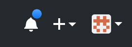
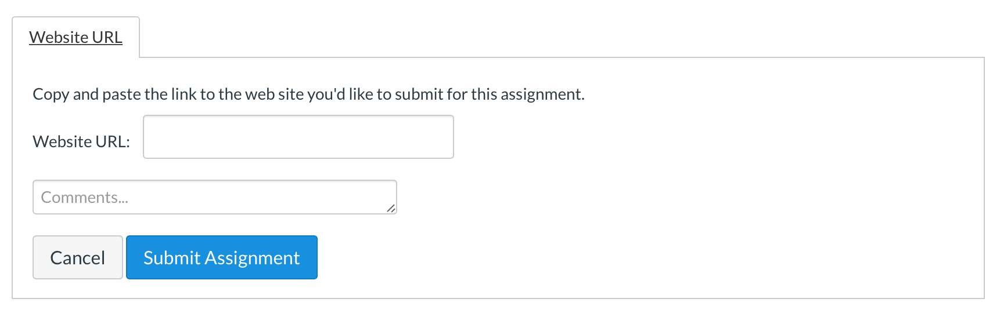

# Submission Instructions

The submission for this challenge is different from what you've been doing. All you have to do is copy the URL of your pull request and paste it into the submission box.

1. Copy the URL of your pull request -- if the pull request is no longer open, reopen it by clicking on the pull requests tab in your repository, it should be the only pull request there.
1. **In Canvas,** click on the **Submit Assignment** button and scroll down to find the submission box.
1. Paste the URL into the box. You may also leave a comment.
1. Click on the **Submit Assignment** button to finalize the submission.
1. After submitting the assignment, keep an eye out for comments on your pull request -- I may want you to correct mistakes -- by default comments will come as e-mail messages and you will also see a blue dot on the bell icon in the upper righthand corner of your GitHub window. Check often (at least once per class) and respond promptly (the same day).

<!-- Don't edit links here, change them in _data/assignment.yml instead, -->

[slides]: <{{site.data.assignment.slides}}>
[template]: <{{site.data.assignment.template}}>
